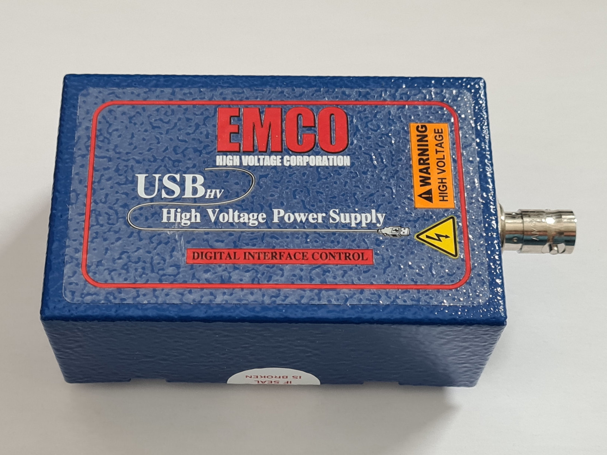

# EMCO USB_HV control module in Python with HID API

This is a Python module to control the EMCO USB_HV power module via the HID API. The module is based on the reverse engineering of the USB protocol used by the EMCO USBhv Series control software. It was tested with USB20N power module.



## Installation

Install with

    pip install .

### Permissions

On Linux remember to set correct permissions for the USB device. You can do it by creating a udev rule. Create a file `/etc/udev/rules.d/99-emco-usbhv.rules` with the following content:
```bash
SUBSYSTEM=="usb", ATTR{idVendor}=="03eb", ATTR{idProduct}=="201d", MODE="0666"
SUBSYSTEM=="hidraw", ATTRS{idVendor}=="03eb", ATTRS{idProduct}=="201d", MODE="0666"
```
or simply run the following command:
```bash
echo 'SUBSYSTEM=="usb", ATTR{idVendor}=="03eb", ATTR{idProduct}=="201d", MODE="0666"' | sudo tee /etc/udev/rules.d/99-emco-usbhv.rules
echo 'SUBSYSTEM=="hidraw", ATTR{idVendor}=="03eb", ATTR{idProduct}=="201d", MODE="0666"' | sudo tee -a /etc/udev/rules.d/99-emco-usbhv.rules
```
Then reload the udev rules:
```bash
sudo udevadm control --reload-rules
sudo udevadm trigger
```

Note:
The first line is required when hidapi < x.x.x is used (e.g. required for hidapi == 0.9.0.post3).
The second line is required when hidapi >= x.x.x is used (e.g. required for hidapi == 0.14.0.post2).

## Usage

See `if __name__ == '__main__'` block in [emco_usbhv/emco_usbhv.py]([emco_usbhv/emco_usbhv.py]).

## GUI Application

The module also includes a simple GUI application to control the EMCO USB_HV power module. The application is based on the `tkinter` library.

Run the application with the following command:
```bash
python emco_usbhv_app.py
